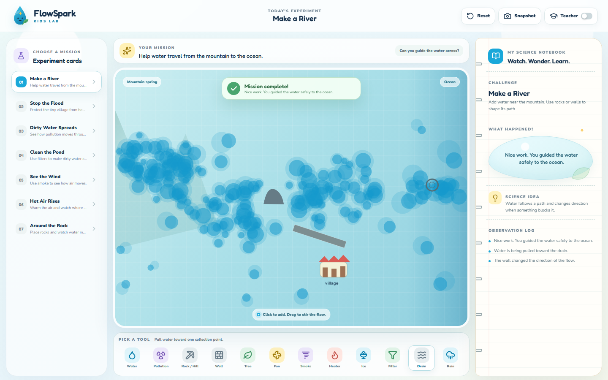

# FlowSpark Kids — Codex Build Brief

Build a polished educational web app called **FlowSpark Kids**.

FlowSpark Kids is a playful science simulation app for primary-school students. It turns fluid simulation into a simple, beautiful learning playground where children can explore water, air, heat, pollution, flooding, filtering, and flow around obstacles by touching, dragging, dropping objects, and observing what happens.

The app should feel like a magical science notebook mixed with a gentle game. It must be useful for students, teachers, and parents, not just visually impressive.

---

## 1. Core concept

Create a browser-based interactive science simulator inspired by WebGL fluid simulations, but redesigned for children.

The central idea:

> Children learn science by changing the world and watching how nature responds.

Students should be able to:

- Drag objects into a simulation area.
- Add water, air, smoke, heat, rain, pollution, trees, rocks, walls, filters, fans, and drains.
- Watch fluids move naturally.
- Complete simple experiment cards.
- Read short explanations written in primary-school language.
- Compare before/after scenarios, such as bare land vs land with trees.
- Save screenshots or short demo videos of experiments.

The project must be visually attractive enough for a portfolio, but simple enough for young students to understand.

---

## 2. Project name

Use this final name:

# **FlowSpark Kids**

Tagline:

> Tiny experiments. Big science moments.

Short description:

> A colorful fluid and nature simulation playground for curious young scientists.

---

## 3. Logo and icon direction

Create a clean, original app icon and logo inside the project. Do not use copyrighted images.

### Icon idea

A cute water droplet mascot with:

- A small spark/star inside it.
- A tiny green leaf beside it.
- A soft round shape.
- Friendly eyes, but not childish in a cheap way.
- Modern educational-app style.

### Icon requirements

Create the following assets:

- `public/icon.svg`
- `public/favicon.svg`
- `public/apple-touch-icon.png`
- `public/og-image.png`

The logo should work on light and dark backgrounds.

### Visual personality

Use a friendly, premium educational look:

- Soft gradients.
- Rounded cards.
- Glassy panels.
- Calm, bright colors.
- Large readable text.
- Motion that feels smooth, not noisy.
- No clutter.

The UI should feel like something from a high-quality learning platform, not a technical physics demo.

---

## 4. Target audience

Primary audience:

- Primary-school students, roughly ages 6–11.

Secondary audience:

- Teachers.
- Parents.
- Science clubs.
- Beginner students learning observation, cause and effect, environment, water flow, and air movement.

Design for children, but do not make it look childish or cheap. It should feel beautiful, calm, and trustworthy.

---

## 5. Technology stack

Use a modern frontend stack that is easy to run and deploy.

Recommended stack:

- Vite
- React
- TypeScript
- WebGL canvas simulation
- Tailwind CSS or carefully written CSS modules
- Framer Motion only if useful and not heavy
- Playwright for screenshots/demo capture if needed

The project should run with:

```bash
npm install
npm run dev
npm run build
```

Also include:

```bash
npm run lint
npm run test
npm run capture:screenshots
npm run capture:video
```

If the video capture script is difficult, implement the most reliable practical version available in the repo environment, but do not leave fake placeholder media.

---

## 6. Simulation philosophy

This app does not need to be a professional CFD solver. It should be an educational fluid playground.

The simulation must be:

- Real-time.
- Smooth.
- Stable.
- Visually clear.
- Interactive.
- Easy to understand.

A simplified 2D GPU fluid simulation is acceptable. It can be based on common stable fluid simulation ideas:

- Velocity field.
- Dye/color field.
- Vorticity/confinement or swirl effect.
- Diffusion/advection.
- Obstacles that block or redirect flow.
- Sources that inject water, smoke, heat, or colored dye.

Prioritize educational clarity over physical perfection.

---

## 7. Main app layout

The app should have a beautiful three-part layout.

### A. Top bar

Include:

- FlowSpark Kids logo.
- Current experiment title.
- Reset button.
- Screenshot button.
- Record demo button.
- Teacher Mode toggle.
- Sound toggle, optional.

### B. Main simulation canvas

The center of the app should be a large interactive canvas.

Users should be able to:

- Drag across the canvas to stir fluid.
- Click to add drops.
- Drag tools from the toolbar onto the canvas.
- Move objects after placing them.
- Remove objects.
- Reset the scene.

The canvas should have a soft frame and subtle background.

### C. Side learning notebook

A right-side panel should look like a friendly science notebook.

It should include:

- Current challenge card.
- “What happened?” section.
- “Science idea” section.
- “Try this next” prompt.
- Small observation log.

Example notebook text:

> I added a rock. The water moved around it. Obstacles can change the path of flowing water.

The notebook should update when children interact with the simulation.

---

## 8. Tools children can use

Create a toolbox with clear icons and labels.

Minimum tools:

1. **Water Drop**
   - Adds clean blue water/dye.
   - Teaches flow and spreading.

2. **Pollution Drop**
   - Adds dark/purple dirty dye.
   - Teaches pollution spread.

3. **Rock**
   - Static obstacle.
   - Water flows around it.

4. **Wall**
   - Larger barrier.
   - Can block or redirect flow.

5. **Tree**
   - Slows water near it.
   - Helps teach flood reduction.

6. **Fan**
   - Pushes smoke/air in one direction.
   - Teaches invisible air movement.

7. **Smoke Puff**
   - Adds visible air/smoke particles.
   - Teaches wind direction.

8. **Heater**
   - Creates upward flow or warmer color motion.
   - Teaches hot air rises.

9. **Ice Block**
   - Creates sinking/cooler flow effect.
   - Teaches cold air/water sinks.

10. **Filter**
    - Reduces pollution color passing through it.
    - Teaches cleaning water.

11. **Drain**
    - Pulls water/dye inward.
    - Teaches water collection and flow direction.

12. **Rain Cloud**
    - Creates falling water/rain drops.
    - Teaches rainfall and flooding.

Each tool should have a short tooltip in child-friendly language.

---

## 9. Experiment cards

Create guided experiments that students can select.

Each experiment card should have:

- Title.
- One-sentence goal.
- Simple steps.
- Observation prompt.
- Science explanation.
- Success condition if possible.

### Required experiments

#### Experiment 1: Make a River

Goal:

> Help water travel from the mountain to the ocean.

Tools:

- Water Drop
- Rock
- Wall
- Drain/Ocean target

Learning:

> Water moves from one place to another and changes path when something blocks it.

#### Experiment 2: Stop the Flood

Goal:

> Protect the tiny village from heavy rain.

Tools:

- Rain Cloud
- Trees
- Rocks
- Walls
- Drain

Learning:

> Trees and barriers can slow down water and reduce flooding.

#### Experiment 3: Dirty Water Spreads

Goal:

> See how pollution moves through water.

Tools:

- Pollution Drop
- Water Drop
- Fan/Flow source

Learning:

> Pollution can spread far from where it starts.

#### Experiment 4: Clean the Pond

Goal:

> Use filters to make dirty water cleaner.

Tools:

- Pollution Drop
- Filter
- Water Drop
- Drain

Learning:

> Filters can remove some dirty particles from water.

#### Experiment 5: See the Wind

Goal:

> Use smoke to see how air moves.

Tools:

- Smoke Puff
- Fan
- Wall

Learning:

> Air is invisible, but we can see its movement when it carries smoke.

#### Experiment 6: Hot Air Rises

Goal:

> Warm the air and watch where it goes.

Tools:

- Heater
- Smoke Puff
- Ice Block

Learning:

> Warm air usually rises, and cooler air moves downward.

#### Experiment 7: Around the Rock

Goal:

> Place rocks and watch water move around them.

Tools:

- Rock
- Water Drop

Learning:

> Flow changes direction when it meets an obstacle.

---

## 10. Teacher Mode

Teacher Mode should add more structure without overwhelming children.

When Teacher Mode is enabled, show:

- Learning objective.
- Recommended discussion questions.
- Vocabulary words.
- Optional explanation with slightly more detail.
- Classroom activity suggestion.

Example vocabulary:

- Flow
- Obstacle
- Pollution
- Filter
- Wind
- Heat
- Rain
- Flood
- Direction
- Observe

Teacher Mode should never expose complex equations.

---

## 11. Kid Mode writing style

All child-facing text should be simple, warm, and short.

Good example:

> The water moved around the rock. The rock changed the water’s path.

Avoid:

> The incompressible velocity field advects scalar dye concentration around a boundary condition.

The app should teach real science without sounding like a textbook.

---

## 12. Visual design details

The UI should be excellent.

### Style direction

- Rounded glass cards.
- Soft shadows.
- Smooth hover effects.
- Large playful buttons.
- High contrast labels.
- Gentle animated background.
- Friendly science notebook panel.
- Beautiful empty state before starting.

### Main background

Use a soft classroom-lab theme:

- Pale sky gradient.
- Subtle paper texture.
- Floating tiny science doodles.
- Gentle animated bubbles or particles.

### Simulation canvas look

The simulation area should look like a magical water table:

- Rounded rectangle.
- Soft inner glow.
- Subtle grid optional.
- Water/dye colors should look vivid but not oversaturated.

### Motion

Use small animations:

- Tool cards lift slightly on hover.
- Experiment cards slide gently.
- Notebook log entries fade in.
- Success celebration uses small sparkles, not loud confetti.

---

## 13. Accessibility

Make the app accessible and comfortable for children.

Include:

- Large clickable targets.
- Keyboard navigation for major controls.
- Clear focus states.
- Reduced-motion support.
- Strong text contrast.
- Simple language.
- No tiny unreadable controls.

---

## 14. Sound design, optional

If sound is added, keep it very subtle.

Possible sounds:

- Soft water plop.
- Gentle sparkle on success.
- Light page-turn sound for notebook updates.

Sound must be off by default or easy to mute.

Do not use copyrighted audio.

---

## 15. State and interaction behavior

The app should keep track of:

- Selected tool.
- Placed objects.
- Current experiment.
- Observation log.
- Teacher Mode status.
- Whether the current goal is completed.

When the user performs actions, update the notebook.

Examples:

- User places rock:
  - Log: “You added a rock. Water will try to move around it.”

- User adds pollution:
  - Log: “The dirty color is spreading through the water.”

- User adds trees during flood experiment:
  - Log: “Trees slowed the water near the village.”

---

## 16. Educational success logic

Implement lightweight success detection for experiments.

Examples:

### Stop the Flood

Success if:

- Rain is active.
- Water/pollution intensity near village area stays below a threshold for a few seconds.
- Trees/walls/drain are used.

### Clean the Pond

Success if:

- Pollution intensity near clean zone decreases after passing through filter.

### See the Wind

Success if:

- Smoke moves in the fan direction.

### Make a River

Success if:

- Water reaches the ocean/drain target.

The success messages should feel encouraging.

Example:

> Nice work. You guided the water safely to the ocean.

---

## 17. Important technical modules

Organize the code cleanly.

Suggested structure:

```text
src/
  app/
    App.tsx
    layout/
  simulation/
    FluidCanvas.tsx
    fluidSolver.ts
    shaders/
    objects.ts
    interactions.ts
  experiments/
    experiments.ts
    successRules.ts
  components/
    TopBar.tsx
    ToolBox.tsx
    Notebook.tsx
    ExperimentCards.tsx
    TeacherPanel.tsx
    RecordButton.tsx
  assets/
    icons/
  styles/
  utils/
    capture.ts
    accessibility.ts
public/
  icon.svg
  favicon.svg
  og-image.png
scripts/
  capture-screenshots.ts
  capture-video.ts
```

Keep the code readable. Use meaningful names. Avoid messy one-file implementation.

---

## 18. Screenshots and actual video

The final README must include both screenshots and an actual demo video.

Do not add fake placeholders.

Create real media assets after the app works.

Required media:

```text
assets/screenshots/home.png
assets/screenshots/experiment-river.png
assets/screenshots/experiment-flood.png
assets/screenshots/teacher-mode.png
assets/demo/flowspark-demo.mp4
```

Also create a GIF fallback if possible:

```text
assets/demo/flowspark-demo.gif
```

The README should embed the media.

Example README section:

```md
## Demo

<video src="assets/demo/flowspark-demo.mp4" controls width="100%"></video>


```

If GitHub does not render local video perfectly, also include a clear link to the video file.

The video must show actual app interaction:

1. Opening screen.
2. Selecting an experiment card.
3. Adding water.
4. Placing rocks/trees/filter.
5. Notebook updating.
6. Success message.
7. Teacher Mode toggle.

---

## 19. README requirements

Create a beautiful, human-written `README.md`.

The README should feel elegant and natural. Avoid robotic phrasing, generic AI-sounding paragraphs, and filler language.

README structure:

```md
# FlowSpark Kids

Tiny experiments. Big science moments.

[Demo image or video]

## What it is
## Why it matters
## What children can explore
## Experiments included
## Screenshots
## Demo video
## Tech stack
## Running locally
## Building
## Project structure
## Educational notes
## Roadmap
## License
```

Include a warm introduction, for example:

> FlowSpark Kids is a small science playground where children can see water, air, heat, and pollution move in front of them. It is built for the moment when a student asks, “What happens if I put this here?”

Do not mention that the README was generated by AI or Codex.

---

## 20. Repository polish

Include:

- `LICENSE` using MIT License.
- `.gitignore`
- `package.json`
- `README.md`
- `CONTRIBUTING.md`, short and friendly.
- `CODE_OF_CONDUCT.md`, optional but recommended.
- `public/icon.svg`
- `assets/screenshots/`
- `assets/demo/`

Make sure the repository looks complete and cared for.

---

## 21. GitHub Pages deployment

Deploy the site using GitHub Pages.

Recommended approach:

- Use Vite build output.
- Configure `base` correctly for GitHub Pages.
- Add GitHub Actions workflow:

```text
.github/workflows/deploy.yml
```

The workflow should:

1. Install dependencies.
2. Run lint/tests if practical.
3. Build the app.
4. Deploy to GitHub Pages.

Also update README with the live site link after deployment.

---

## 22. Commits

Make separate, meaningful commits.

Use natural human-style commit messages.

Suggested commits:

```text
git commit -m "Set up FlowSpark Kids app shell"
git commit -m "Build the fluid playground canvas"
git commit -m "Add experiment cards and notebook guidance"
git commit -m "Design the kid-friendly interface"
git commit -m "Add screenshots and demo recording"
git commit -m "Write the project README"
git commit -m "Deploy FlowSpark Kids to GitHub Pages"
```

Do not make one giant commit unless absolutely necessary.

---

## 23. Quality checklist before finishing

Before finalizing the project, verify:

- App runs locally.
- App builds without errors.
- Main simulation works.
- Tools can be selected and used.
- Experiment cards are readable.
- Notebook updates after interactions.
- Teacher Mode works.
- Reset works.
- Screenshot capture works.
- Demo video is real.
- README contains actual screenshots and video.
- MIT license exists.
- GitHub Pages deployment works.
- Final repository has clean commits.

---

## 24. Things to avoid

Avoid:

- Placeholder screenshots.
- Placeholder video.
- Overly complex equations.
- A UI that looks like a raw technical demo.
- AI-sounding README text.
- Robotic commit messages.
- Copyrighted icons, mascots, or audio.
- Heavy dependencies unless truly needed.
- A simulation that is beautiful but educationally empty.

---

## 25. Final delivery expectation

At the end, the project should have:

1. A working browser app.
2. A beautiful original icon/logo.
3. A polished child-friendly UI.
4. Multiple educational experiments.
5. Teacher Mode.
6. A readable, elegant README.
7. Real screenshots.
8. A real demo video.
9. MIT License.
10. Separate commits.
11. A live GitHub Pages deployment.

The final result should feel like a small but serious educational product, not a weekend toy.

---

## 26. Optional stretch ideas

Only add these after the core app is working.

### A. Student worksheet export

Allow teachers to export a simple worksheet with:

- Experiment title.
- What I changed.
- What I observed.
- What I learned.

### B. Classroom challenge mode

Add small challenges like:

- “Can you keep the village dry for 20 seconds?”
- “Can you clean the pond using only two filters?”
- “Can you make smoke reach the flag?”

### C. Multi-language mode

Add a simple language system so explanations can later be translated into Urdu, English, or other languages.

### D. Low-power mode

Add a performance toggle for older school computers.

### E. Share experiment card

Create a downloadable image of the final experiment with the observation log.

---

## 27. Suggested first implementation path

Build in this order:

1. Set up Vite + React + TypeScript.
2. Create the app shell and visual identity.
3. Build a basic interactive fluid canvas.
4. Add object placement: rock, wall, fan, pollution, water.
5. Add experiment cards.
6. Add notebook updates.
7. Add Teacher Mode.
8. Add success messages.
9. Polish responsive design.
10. Add capture scripts for screenshots and video.
11. Write README.
12. Add MIT License.
13. Commit in stages.
14. Deploy to GitHub Pages.

Build the smallest beautiful working version first, then improve it.

---

## 28. Final tone of the project

Every part of this project should carry this feeling:

> Science becomes easier when children can see it move.

Make FlowSpark Kids charming, useful, and memorable.
