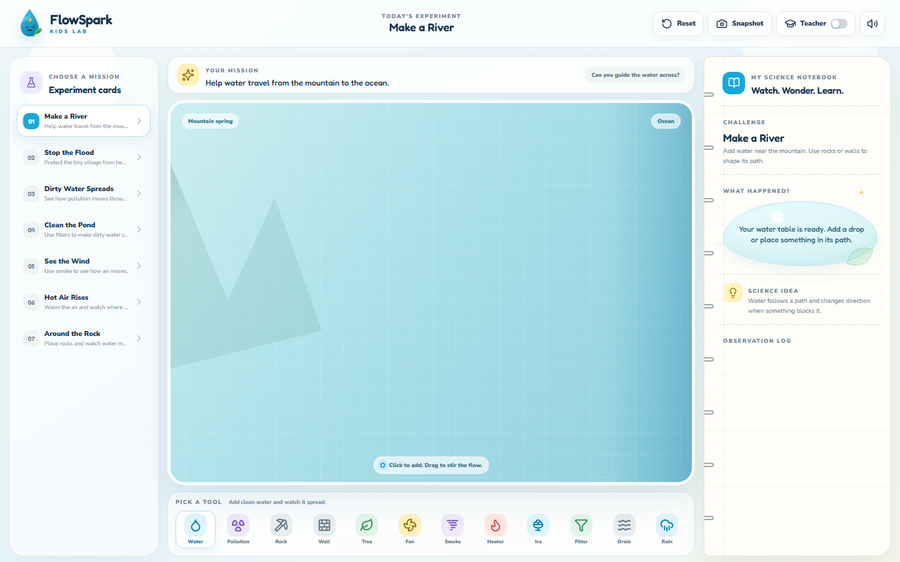
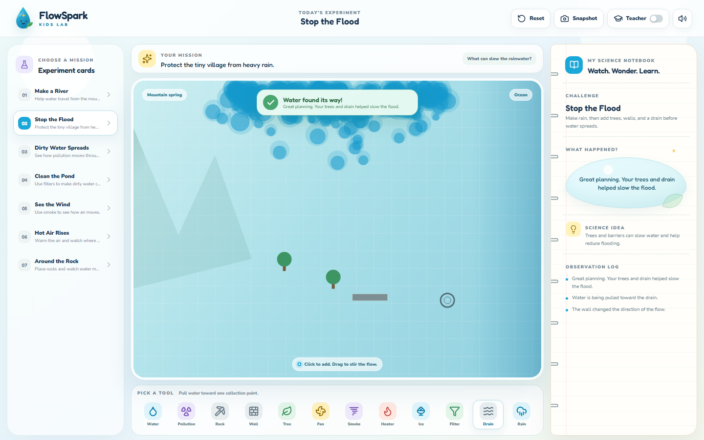
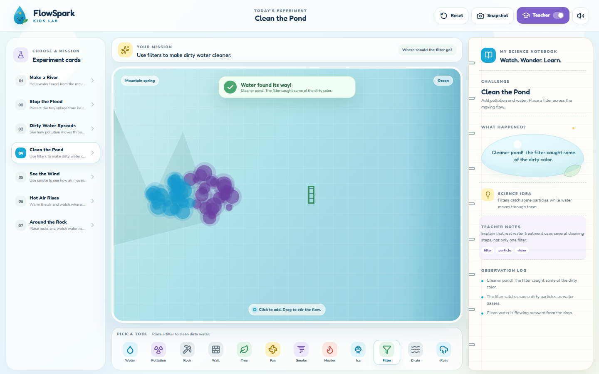

# FlowSpark Kids

**Tiny experiments. Big science moments.**

[Live demo](https://hasnain7abbas.github.io/FlowSpark-Kids/)



FlowSpark Kids is a small science playground where children can see water, air,
heat, and pollution move in front of them. It is built for the moment when a
student asks, "What happens if I put this here?"

## What it is

FlowSpark Kids is a browser-based learning app for primary-school science. It
combines a playful water-table canvas, simple experiment cards, and a friendly
science notebook so children can change a scene and describe what they observe.

## Why it matters

Fluid motion is usually invisible, abstract, or hidden behind equations. This
app keeps the science visible: water bends around rocks, dirty color spreads,
smoke shows wind, filters clean part of a flow, and warm or cool effects move in
different directions.

## What children can explore

- Guide water around rocks and walls.
- See pollution spread through moving water.
- Use smoke to reveal air movement.
- Compare rising warm air with sinking cool flow.
- Slow water with trees and clean dirty flow with filters.
- Add rain, drains, fans, and obstacles to test a prediction.

## Experiments included

1. Make a River
2. Stop the Flood
3. Dirty Water Spreads
4. Clean the Pond
5. See the Wind
6. Hot Air Rises
7. Around the Rock

## Screenshots






## Demo video

<video src="assets/demo/flowspark-demo.mp4" controls width="100%"></video>

If the video does not render in your browser, open
[flowspark-demo.mp4](assets/demo/flowspark-demo.mp4) or
[flowspark-demo.gif](assets/demo/flowspark-demo.gif).

## Tech stack

- React
- TypeScript
- Vite
- Canvas 2D
- Playwright capture scripts
- GitHub Pages deployment

The simulation is intentionally educational rather than a professional fluid
solver. It uses particles, directional forces, obstacles, local effects, and
lightweight success rules to make cause and effect easy to see.

## Running locally

```bash
npm install
npm run dev
```

Open the local URL printed by Vite.

## Building

```bash
npm run lint
npm run test
npm run build
```

## Capturing media

```bash
npm run generate:assets
npm run capture:screenshots
npm run capture:video
```

The capture scripts start a local Vite server, interact with the real app, and
write media to `assets/screenshots` and `assets/demo`.

## Project structure

```text
src/
  App.tsx
  data.ts
  experiments/
  simulation/
  types.ts
scripts/
  capture-screenshots.mjs
  capture-video.mjs
  generate-assets.mjs
assets/
  screenshots/
  demo/
public/
  icon.svg
  apple-touch-icon.png
  og-image.png
```

## Educational notes

Teacher Mode adds objectives, vocabulary, and discussion prompts without
showing equations. Child-facing text stays short and observational: "The rock
changed the water's path" is more useful here than technical fluid language.

## Roadmap

- Let students move or delete placed objects.
- Add worksheet export for classrooms.
- Add an optional low-power rendering mode.
- Add language files for future Urdu and English classroom variants.
- Expand success rules with more direct canvas measurements.

## License

FlowSpark Kids is available under the [MIT License](LICENSE).
